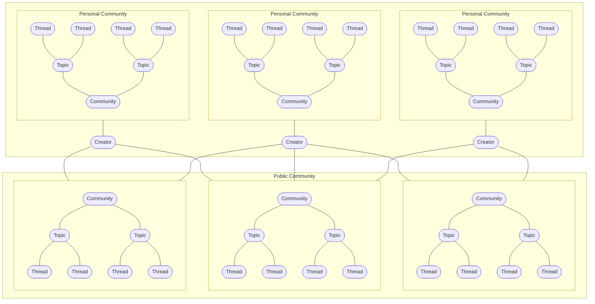

# Creator's playground

- Good to see you!
- We can easily create ideas that were only in your imagination.

```mermaid
flowchart TB
  subgraph user[ ]
    direction TB
    creator1([Creator])
    creator2([Creator])
    creator3([Creator])
    subgraph creator1-community[Personal Community]
          direction TB
          creator1-cm([Community])
          creator1-cm-tp1([Topic])
          creator1-cm-tp2([Topic])
          creator1-cm-th1([Thread])
          creator1-cm-th2([Thread])
          creator1-cm-th3([Thread])
          creator1-cm-th4([Thread])
          creator1-cm-tp1---creator1-cm
          creator1-cm-tp2---creator1-cm
          creator1-cm-th1---creator1-cm-tp1
          creator1-cm-th2---creator1-cm-tp1
          creator1-cm-th3---creator1-cm-tp2
          creator1-cm-th4---creator1-cm-tp2
    end
    subgraph creator2-community[Personal Community]
          direction TB
          creator2-cm([Community])
          creator2-cm-tp1([Topic])
          creator2-cm-tp2([Topic])
          creator2-cm-th1([Thread])
          creator2-cm-th2([Thread])
          creator2-cm-th3([Thread])
          creator2-cm-th4([Thread])
          creator2-cm-tp1---creator2-cm
          creator2-cm-tp2---creator2-cm
          creator2-cm-th1---creator2-cm-tp1
          creator2-cm-th2---creator2-cm-tp1
          creator2-cm-th3---creator2-cm-tp2
          creator2-cm-th4---creator2-cm-tp2
    end
    subgraph creator3-community[Personal Community]
          direction TB
          creator3-cm([Community])
          creator3-cm-tp1([Topic])
          creator3-cm-tp2([Topic])
          creator3-cm-th1([Thread])
          creator3-cm-th2([Thread])
          creator3-cm-th3([Thread])
          creator3-cm-th4([Thread])
          creator3-cm-tp1---creator3-cm
          creator3-cm-tp2---creator3-cm
          creator3-cm-th1---creator3-cm-tp1
          creator3-cm-th2---creator3-cm-tp1
          creator3-cm-th3---creator3-cm-tp2
          creator3-cm-th4---creator3-cm-tp2
    end
    creator1-community---creator1
    creator2-community---creator2
    creator3-community---creator3
  end
  
  subgraph public-community[Public Community]
    subgraph pc-1[ ]
          direction TB
          cm01([Community])
          cm01-tp01([Topic])
          cm01-tp02([Topic])
          cm01-th01([Thread])
          cm01-th02([Thread])
          cm01-th03([Thread])
          cm01-th04([Thread])
          cm01---cm01-tp01
          cm01---cm01-tp02
          cm01-tp01---cm01-th01
          cm01-tp01---cm01-th02
          cm01-tp02---cm01-th03
          cm01-tp02---cm01-th04
      end

    subgraph pc-2[ ]
          direction TB
          cm02([Community])
          cm02-tp01([Topic])
          cm02-tp02([Topic])
          cm02-th01([Thread])
          cm02-th02([Thread])
          cm02-th03([Thread])
          cm02-th04([Thread])
          cm02---cm02-tp01
          cm02---cm02-tp02
          cm02-tp01---cm02-th01
          cm02-tp01---cm02-th02
          cm02-tp02---cm02-th03
          cm02-tp02---cm02-th04
    end

    subgraph pc-3[ ]
          direction TB
          cm03([Community])
          cm03-tp01([Topic])
          cm03-tp02([Topic])
          cm03-th01([Thread])
          cm03-th02([Thread])
          cm03-th03([Thread])
          cm03-th04([Thread])
          cm03---cm03-tp01
          cm03---cm03-tp02
          cm03-tp01---cm03-th01
          cm03-tp01---cm03-th02
          cm03-tp02---cm03-th03
          cm03-tp02---cm03-th04
    end

  end
  creator1---pc-1
  creator1---pc-2
  creator2---pc-1
  creator2---pc-2
  creator2---pc-3
  creator3---pc-2
  creator3---pc-3
```